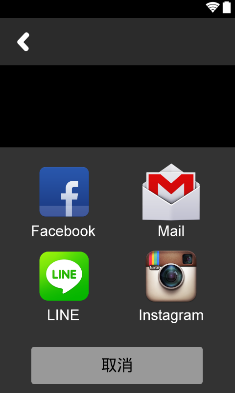

# TableLayout 產生平均間隔分配

android:stretchColumns="0,2,4"

0,2,4都是有空隙的Column，其中4必須給予View,否則無法產生空隙

	<View
	    android:layout_width="1dp"
	    android:layout_height="1dp"
	    android:layout_column="4" />

##Layout原始碼

	<TableLayout
        android:layout_width="match_parent"
        android:layout_height="wrap_content"
        android:background="#333333"
        android:stretchColumns="0,2,4">

        <TableRow android:layout_marginTop="@dimen/gap_xl">

            <ImageView
                android:id="@+id/share_by_fb_button"
                android:layout_width="wrap_content"
                android:layout_height="wrap_content"
                android:layout_column="1"
                android:clickable="true"
                android:src="@drawable/icon_share_fb" />

            <ImageView
                android:id="@+id/share_by_email_button"
                android:layout_width="wrap_content"
                android:layout_height="wrap_content"
                android:layout_column="3"
                android:clickable="true"
                android:src="@drawable/icon_share_mail" />

            <View
                android:layout_width="1dp"
                android:layout_height="1dp"
                android:layout_column="4" />
        </TableRow>

        <TableRow android:layout_marginBottom="@dimen/gap_xl">

            <ImageView
                android:id="@+id/share_by_line_button"
                android:layout_width="wrap_content"
                android:layout_height="wrap_content"
                android:layout_column="1"
                android:clickable="true"
                android:src="@drawable/icon_share_line" />

            <ImageView
                android:id="@+id/share_by_instagram_button"
                android:layout_width="wrap_content"
                android:layout_height="wrap_content"
                android:layout_column="3"
                android:clickable="true"
                android:src="@drawable/icon_share_instagram" />
        </TableRow>

        <TableRow>

            <Button
                android:layout_width="wrap_content"
                android:layout_height="wrap_content"
                android:layout_column="1"
                android:layout_margin="@dimen/gap_large"
                android:layout_span="3"
                android:background="@drawable/fragment_share_cancel_bg"
                android:onClick="onBackPressed"
                android:paddingBottom="@dimen/gap_large"
                android:paddingTop="@dimen/gap_large"
                android:text="@string/cancel"
                android:textAppearance="?android:textAppearanceLarge" />
        </TableRow>
    </TableLayout>
